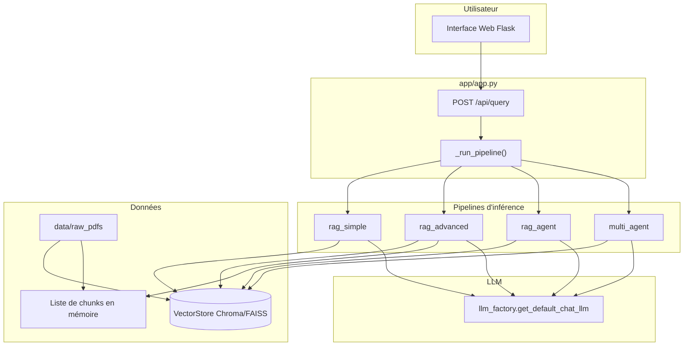
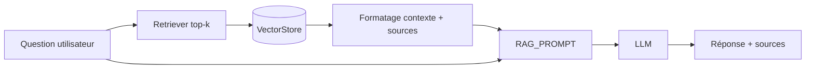
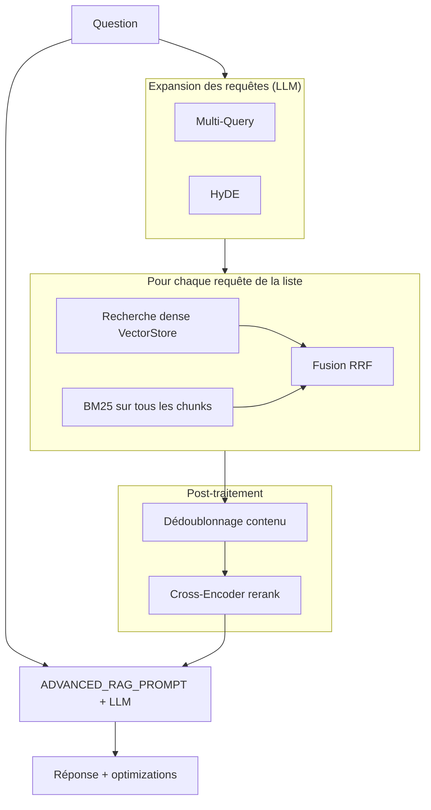
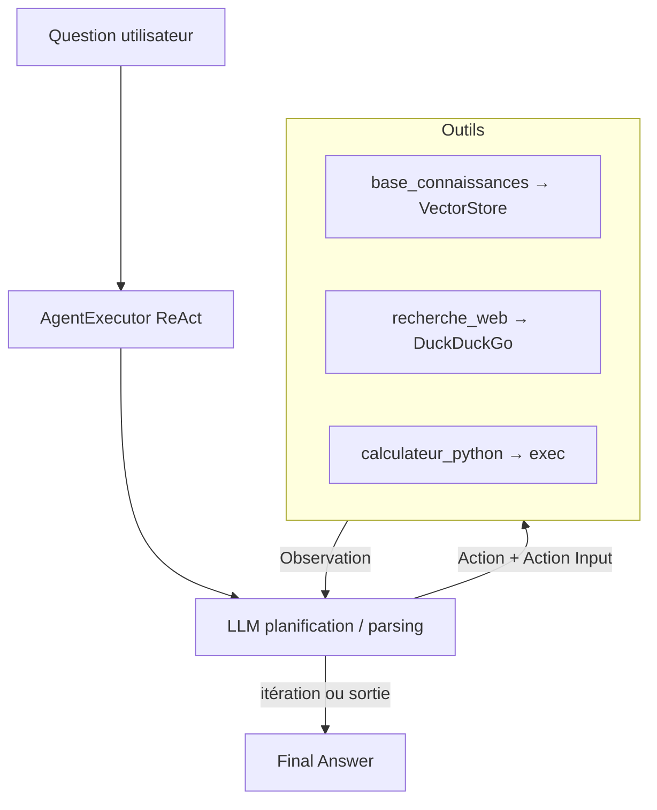
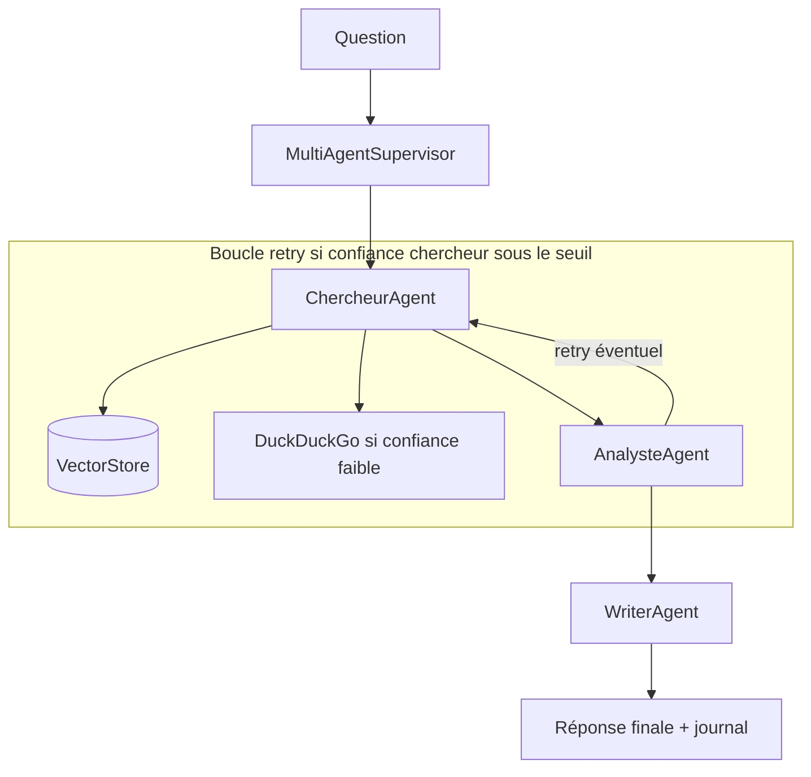

# Pipelines, architecture et fonctionnement du projet

Ce document décrit **l’architecture globale**, les **flux de données** (PDF → index → réponse), et le **fonctionnement détaillé** de chaque pipeline d’inférence exposé par l’API, ainsi que les **étapes hors ligne** (dataset, benchmark, RAFT, fine-tuning).

---

## Table des matières

1. [Vue d’ensemble](#1-vue-densemble)
2. [Architecture globale](#2-architecture-globale)
3. [Couche ingestion : PDF → chunks](#3-couche-ingestion--pdf--chunks)
4. [Couche index : Vector Store](#4-couche-index--vector-store)
5. [Couche LLM](#5-couche-llm)
6. [Pipelines d’inférence (chat / API)](#6-pipelines-dinférence-chat--api)
7. [Pipelines et étapes CLI (`run.py`)](#7-pipelines-et-étapes-cli-runpy)
8. [Application Flask : cycle de vie de l’index](#8-application-flask--cycle-de-vie-de-lindex)
9. [Configuration clé](#9-configuration-clé)
10. [Comparatif des pipelines](#10-comparatif-des-pipelines)
11. [Fichiers sources par responsabilité](#11-fichiers-sources-par-responsabilité)
12. [Résultats sur le projet](#12-résultats-sur-le-projet)

---

## 1. Vue d’ensemble

Le projet implémente un système de **question-réponse** sur des documents PDF, avec plusieurs stratégies de récupération et de génération :

| Rôle           | Description                                                                                                 |
| -------------- | ----------------------------------------------------------------------------------------------------------- |
| **Ingestion**  | Lecture des PDF, nettoyage, découpage en chunks, métadonnées (`chunk_id`, `source_file`).                   |
| **Indexation** | Embeddings + stockage vectoriel (Chroma ou FAISS, persistance sous `vectorstore/`).                         |
| **Inférence**  | Quatre modes : RAG simple, RAG avancé, agent ReAct, orchestration multi-agents.                             |
| **Hors ligne** | Génération de dataset d’évaluation, benchmark LLM, construction d’un dataset RAFT, préparation fine-tuning. |

L’interface web (Flask) sélectionne la pipeline via le corps JSON de `POST /api/query` (`pipeline`).

---

## 2. Architecture globale

### 2.1. Schéma logique



### 2.2. Deux contextes d’exécution

1. **CLI** (`python run.py --step …`) : exécute une étape isolée (dataset, benchmark, construction RAG en mémoire pour test, serveur Flask).
2. **Serveur Flask** (`python run.py --step serve`) : maintient un cache global `pipelines` (vector store + chunks), sert l’UI et les routes `/api/*`.

Les quatre pipelines de chat **ne sont pas des services long-running séparés** : à chaque requête, `_run_pipeline` instancie la classe appropriée (`SimpleRAG`, `AdvancedRAG`, `RAGAgent`, `MultiAgentSupervisor`) avec le **même** `VectorStore` déjà chargé ou reconstruit.

---

## 3. Couche ingestion : PDF → chunks

**Fichier :** `src/pdf_processor.py` — classe `PDFProcessor`.

### 3.1. Étapes

1. **Chargement** : `DirectoryLoader` + `PyPDFLoader` sur `data/raw_pdfs/**/*.pdf`.
2. **Nettoyage** : `clean_text()` — normalisation des sauts de ligne, espaces, motifs type « Page x of y ».
3. **Découpage** : `RecursiveCharacterTextSplitter` avec `CHUNK_SIZE`, `CHUNK_OVERLAP` (voir `src/config.py`).
4. **Métadonnées** : pour chaque chunk, `chunk_id` (index global) et `source_file` (nom du fichier PDF).

### 3.2. Sortie

Une liste de `langchain.schema.Document` : unité d’indexation et de citation dans les réponses.

---

## 4. Couche index : Vector Store

**Fichier :** `src/config.py` (`EMBEDDING_MODEL`, `VECTOR_DB_TYPE`, `VECTORSTORE_DIR`) et `src/vector_store.py`.

### 4.1. Embeddings

- Modèle par défaut : **`sentence-transformers/all-MiniLM-L6-v2`** (via `HuggingFaceEmbeddings`).

### 4.2. Backends

- **`chroma`** (défaut) : persistance sous `vectorstore/chroma/`.
- **`faiss`** : alternative configurée dans le code.

### 4.3. Compatibilité Chroma

Les métadonnées sont normalisées (`chroma_safe_metadata`, `documents_for_chroma`) pour respecter les types acceptés par Chroma. La télémétrie produit est remplacée par une implémentation no-op (`ChromaNoOpTelemetry`) pour éviter des erreurs avec certaines versions / PostHog.

### 4.4. Opérations utiles

- `create_from_documents(chunks)` : construit l’index à partir des chunks.
- `load()` : recharge l’index persisté.
- `similarity_search` / `similarity_search_with_scores` : récupération top-k.
- `get_retriever` : retriever LangChain pour chaînes déclaratives.

---

## 5. Couche LLM

**Fichier :** `src/llm_factory.py` — `get_default_chat_llm()`.

Le provider (OpenAI, Hugging Face Inference, etc.) est piloté par la configuration d’environnement (voir `.env` et `src/config.py`). L’UI et le benchmark peuvent **aligner le modèle de chat** sur le gagnant du benchmark via `src/env_persist.py` (`apply_benchmark_winner_to_chat`).

Toutes les pipelines d’inférence Flask utilisent `_get_llm()` dans `app/app.py`, qui délègue à `get_default_chat_llm()`.

---

## 6. Pipelines d’inférence (chat / API)

**Point d’entrée API :** `POST /api/query` avec JSON du type :

```json
{
  "question": "Votre question",
  "pipeline": "rag_simple"
}
```

Valeurs supportées pour `pipeline` : `rag_simple`, `rag_advanced`, `rag_agent`, `multi_agent`.

**Implémentation :** `app/app.py` → `_run_pipeline(question, pipeline_type)`.

Prérequis : `_ensure_vector_store_for_query()` doit avoir réussi (PDFs présents et index construit ou rechargé).

Chaque pipeline ci-dessous est complété par un **schéma logique d’architecture** (diagrammes Mermaid : rendu dans GitHub, Obsidian, VS Code avec extension, etc.).

---

### 6.1. `rag_simple` — RAG classique

**Fichier :** `src/rag_simple.py` — classe `SimpleRAG`.

**Architecture :** _Question → retrieval top-k → prompt avec contexte → LLM → réponse._

**Détail du flux :**

1. `similarity_search(question, k=RAG_TOP_K)` sur le `VectorStore`.
2. Chaîne LangChain : retriever (même logique) + formatage des documents (source + contenu) → `RAG_PROMPT` → LLM → `StrOutputParser`.
3. Réponse JSON-like (dict) : `answer`, `sources` (extrait, `source_file`, `chunk_id`), `num_sources`, `pipeline: "rag_simple"`.

**Variante :** `query_with_scores` utilise les scores de similarité dans le contexte (usage diagnostic / comparaison).

**Caractéristiques :** une seule requête embedding, pas de rerank ni d’expansion de requête — **latence et coût LLM généralement les plus faibles** pour une réponse standard.

#### Schéma logique — `rag_simple`



_La chaîne LangChain fusionne la même entrée `question` dans deux branches : `context` via retriever + formatage, et `question` telle quelle, puis un seul appel LLM après le template._

---

### 6.2. `rag_advanced` — RAG enrichi

**Fichier :** `src/rag_advanced.py` — classe `AdvancedRAG`.

**Architecture :** _Question → expansions (HyDE, multi-query) → recherche (dense et/ou hybride) → déduplication → rerank cross-encoder → prompt → LLM._

**Composants :**

| Composant       | Rôle                                                                                                                                                    |
| --------------- | ------------------------------------------------------------------------------------------------------------------------------------------------------- |
| **HyDE**        | Le LLM génère un court paragraphe « hypothétique » qui répondrait à la question ; ce texte sert de requête supplémentaire pour la recherche sémantique. |
| **Multi-query** | Le LLM produit jusqu’à 3 reformulations ; la question originale reste incluse (max 4 requêtes au total).                                                |
| **Hybride**     | `similarity_search` (dense) + `BM25Retriever` (sparse) sur la liste complète des chunks ; fusion **RRF** (Reciprocal Rank Fusion).                      |
| **Reranker**    | `CrossEncoderReranker` (`RERANKER_MODEL`, défaut cross-encoder MS MARCO) réordonne les documents fusionnés.                                             |
| **Génération**  | `ADVANCED_RAG_PROMPT` avec contexte limité aux `top_k` premiers après rerank.                                                                           |

**Paramètres d’activation** (constructeur) : `use_reranker`, `use_hyde`, `use_hybrid`, `use_multi_query` — dans Flask, tous sont activés et `all_documents=chunks` est requis pour BM25.

**Sortie :** `answer`, `sources` (avec `rerank_score` si présent), `optimizations` (booleans), `pipeline: "rag_advanced"`.

**Note :** Le fichier importe aussi `ContextualCompressionRetriever` / `LLMChainFilter` (LangChain) mais **le chemin `query()` actuel ne les utilise pas** : la compression contextuelle n’est pas dans la chaîne d’exécution par défaut.

#### Schéma logique — `rag_advanced`



_Comportement réel dans le code : si `use_multi_query` et `use_hyde` sont tous deux à `True`, le LLM HyDE est invoqué puis la liste de requêtes est **remplacée** par celle du Multi-Query — seules les reformulations Multi-Query pilotent la boucle de recherche. Avec `use_multi_query=False`, la liste est `[question]` éventuellement enrichie du document HyDE._

---

### 6.3. `rag_agent` — RAG + outils (ReAct)

**Fichier :** `src/rag_agent.py` — classes `RAGAgent`, `RAGAgentTools`.

**Architecture :** _Agent ReAct (LangChain) : boucle Thought / Action / Observation jusqu’à « Final Answer »._

**Outils :**

| Outil                | Fonction                                                                            |
| -------------------- | ----------------------------------------------------------------------------------- |
| `base_connaissances` | `similarity_search` sur le vector store (extraits avec source).                     |
| `recherche_web`      | `DuckDuckGoSearchRun`.                                                              |
| `calculateur_python` | `exec` du code dans un environnement avec builtins (usage à risquer en production). |

**Exécution :** `AgentExecutor` avec `max_iterations` depuis `AGENT_CONFIG`, `return_intermediate_steps=True`.

**Sortie :** `answer`, `steps` (outil, entrée, observation tronquée), `tools_used`, `pipeline: "rag_agent"`.

**Comportement attendu :** le prompt incite à **commencer par la base interne**, puis le web si besoin.

#### Schéma logique — `rag_agent`



_Boucle : le LLM produit Thought / Action / Action Input jusqu’à « Final Answer », dans la limite de `max_iterations`._

---

### 6.4. `multi_agent` — Orchestration Chercheur → Analyste → Rédacteur

**Fichier :** `src/raft_multi_agent.py` — `ResearcherAgent`, `AnalystAgent`, `WriterAgent`, `MultiAgentSupervisor`.

**Important — nommage :** l’étape CLI s’intitule « RAFT + Multi-Agent » dans les messages, mais **à l’inférence ce module n’applique pas l’algorithme RAFT** (pas de fine-tuning RAFT ici). Il s’agit d’un **workflow multi-agents supervisé** sur le même vector store. Le **dataset RAFT** pour entraînement est construit séparément (`src/raft.py`, étape `run.py --step raft`).

**Flux du superviseur (`process`) :**

1. **Chercheur** : `similarity_search` → contexte RAG concaténé → LLM avec consigne (format CONFIANCE / SOURCES / CONTENU). Si confiance extraite &lt; 0,7, complément **DuckDuckGo**.
2. **Analyste** : LLM sur la sortie du chercheur (fiabilité, points clés, lacunes).
3. **Boucle retry** : si `research.confidence < min_confidence` (défaut 0,5), jusqu’à `max_retries` nouvelles passes avec question affinée.
4. **Rédacteur** : LLM produit la réponse finale utilisateur à partir de l’analyse.

**Sortie :** `answer`, `confidence`, `agents_used`, `conversation_log` (aperçus), `retries`, `pipeline: "raft_multi_agent"` (identifiant technique conservé dans le code).

#### Schéma logique — `multi_agent`



_En pratique : une passe Chercheur (RAG + évaluation LLM + web optionnel) → Analyste → si la confiance du chercheur reste sous `min_confidence`, nouvelle passe avec question affinée ; puis **un** passage par le Rédacteur sur la dernière analyse._

---

## 7. Pipelines et étapes CLI (`run.py`)

**Fichier racine :** `run.py` — dictionnaire `STEPS`.

| Étape CLI     | Fonction              | Rôle                                                                                                                  |
| ------------- | --------------------- | --------------------------------------------------------------------------------------------------------------------- |
| `dataset`     | `step_1_dataset`      | Génère le dataset d’évaluation (PDF + LLM si possible, sinon templates), sauvegarde JSON.                             |
| `benchmark`   | `step_2_benchmark`    | Compare les LLM sur un échantillon du dataset, enregistre les résultats, peut aligner le chat sur le meilleur modèle. |
| `rag`         | `step_3_rag_simple`   | Construit chunks + index + `SimpleRAG` (usage test console).                                                          |
| `rag-adv`     | `step_4_rag_advanced` | Idem avec `AdvancedRAG` et tous les flags d’optimisation.                                                             |
| `finetune`    | `step_5_finetune`     | Prépare le fine-tuning (formatage dataset, `FineTuner`) — exécution lourde sur GPU attendue.                          |
| `raft`        | `step_6_raft`         | Construit un dataset d’exemples RAFT (oracle / distracteurs / CoT) à partir des chunks + Q/R.                         |
| `agent`       | `step_7_agent`        | Instancie `RAGAgent` en local.                                                                                        |
| `multi-agent` | `step_8_multi_agent`  | Instancie `MultiAgentSupervisor` en local.                                                                            |
| `serve`       | `step_serve`          | Lance Flask (`create_app()`, port/host depuis config).                                                                |
| `all`         | —                     | Enchaîne toutes les étapes **sauf** `serve`.                                                                          |

**Note :** le docstring en tête de `run.py` mentionne `--step evaluate` ; cette option **n’est pas** dans `argparse` / `STEPS`. L’évaluation comparative de pipelines est disponible côté code dans `src/evaluator.py` pour intégration manuelle ou scripts futurs.

---

## 8. Application Flask : cycle de vie de l’index

**Fichier :** `app/app.py`.

### 8.1. Cache `pipelines`

- `vector_store` : instance `VectorStore` prête pour les requêtes.
- `chunks` : liste des `Document` du dernier `process_pipeline()` — **nécessaire** pour `rag_advanced` (BM25 + fusion).

### 8.2. `_ensure_vector_store_for_query()`

1. Calcule une **empreinte** des PDF bruts (`src/index_fingerprint.py`) et la compare à celle stockée (fichier fingerprint dans `vectorstore/`).
2. Si l’index persisté existe et correspond aux fichiers : `VectorStore.load()` + rechargement des chunks.
3. Si les PDFs ont changé : purge éventuelle de l’ancien index (`clear_persisted_vectorstore`), puis **réindexation complète** (`create_from_documents`).
4. Met à jour le fingerprint après indexation réussie.

### 8.3. Routes utiles (aperçu)

| Route                     | Usage                                                     |
| ------------------------- | --------------------------------------------------------- |
| `GET /api/health`         | État, clés chargées dans `pipelines`.                     |
| `GET/POST /api/settings`  | Paramètres persistés ; peut invalider le cache vectoriel. |
| `POST /api/upload`        | Ajout de PDF.                                             |
| `POST /api/index`         | Réindexation explicite.                                   |
| `POST /api/query`         | Question + choix de `pipeline`.                           |
| `GET /api/pipelines`      | Liste des pipelines disponibles.                          |
| `POST /api/benchmark/run` | Lance le benchmark depuis l’UI.                           |

---

## 9. Configuration clé

Principalement dans **`src/config.py`** et **`.env`** :

- **Chunks :** `CHUNK_SIZE`, `CHUNK_OVERLAP`.
- **RAG :** `RAG_TOP_K`, `RAG_SCORE_THRESHOLD`, `RERANKER_MODEL`.
- **Vector DB :** `VECTOR_DB_TYPE` (`chroma` / `faiss`).
- **RAFT (dataset) :** `RAFT_CONFIG` (nombre de distracteurs, probabilité oracle, CoT).
- **Agent :** `AGENT_CONFIG` (`max_iterations`, etc.).
- **Multi-agent (doc) :** `MULTI_AGENT_CONFIG` décrit les rôles ; les hyperparamètres de retry du superviseur sont surtout dans le constructeur de `MultiAgentSupervisor` (`max_retries`, `min_confidence`).
- **Flask :** `FLASK_CONFIG`.

---

## 10. Comparatif des pipelines

| Critère                     | `rag_simple`                               | `rag_advanced`                            | `rag_agent`                    | `multi_agent`                                       |
| --------------------------- | ------------------------------------------ | ----------------------------------------- | ------------------------------ | --------------------------------------------------- |
| Appels LLM par question     | 1 (+ chaîne interne alignée sur retriever) | Plusieurs (HyDE, multi-query, génération) | Variable (boucle ReAct)        | Plusieurs (chercheur, analyste, rédacteur, retries) |
| Retrieval                   | Dense seul                                 | Dense + BM25 + fusion + rerank            | Via outil `base_connaissances` | Dense puis complément web si confiance basse        |
| Web                         | Non                                        | Non                                       | Oui (outil)                    | Oui (Chercheur)                                     |
| Exécution Python arbitraire | Non                                        | Non                                       | Oui (outil)                    | Non dans les agents listés                          |
| Traçabilité                 | Sources listées                            | Sources + scores rerank                   | Étapes intermédiaires          | Journal d’agents + confiance                        |

---

## 11. Fichiers sources par responsabilité

| Fichier                    | Responsabilité                                             |
| -------------------------- | ---------------------------------------------------------- |
| `run.py`                   | Orchestration CLI des étapes.                              |
| `app/app.py`               | Flask, cache index, routage vers les pipelines.            |
| `src/pdf_processor.py`     | Ingestion PDF.                                             |
| `src/vector_store.py`      | Embeddings, Chroma/FAISS, persistance.                     |
| `src/rag_simple.py`        | RAG simple LangChain.                                      |
| `src/rag_advanced.py`      | HyDE, multi-query, hybride, rerank.                        |
| `src/rag_agent.py`         | Agent ReAct + outils.                                      |
| `src/raft_multi_agent.py`  | Superviseur multi-agents à l’inférence.                    |
| `src/raft.py`              | Construction du **dataset** RAFT (hors inférence).         |
| `src/llm_factory.py`       | Instanciation du LLM chat.                                 |
| `src/dataset_generator.py` | Génération / chargement du dataset d’évaluation.           |
| `src/llm_benchmark.py`     | Benchmark des modèles.                                     |
| `src/env_persist.py`       | Persistance `.env` / alignement modèle chat.               |
| `src/index_fingerprint.py` | Cohérence PDF ↔ index.                                     |
| `src/fine_tuning.py`       | Fine-tuning (LoRA/QLoRA).                                  |
| `src/evaluator.py`         | Évaluation comparative de pipelines (module réutilisable). |

---

## 12. Résultats sur le projet

Cette section synthétise les **artefacts mesurables** présents dans le dépôt (`data/evaluation/`). Les chiffres ci-dessous correspondent à un **instantané** : régénérer le dataset et relancer le benchmark met à jour ces fichiers.

### 12.1. Dataset d’évaluation

Fichier : `data/evaluation/dataset_evaluation.json`.

| Indicateur                           | Valeur (instantané enregistré)                                            |
| ------------------------------------ | ------------------------------------------------------------------------- |
| **Nombre de questions**              | 22                                                                        |
| **Domaine**                          | `documents`                                                               |
| **Mode de génération**               | `pdf_chunks` (questions/réponses alignées sur les chunks PDF via LLM)     |
| **Date de génération (métadonnées)** | 2026-04-03                                                                |
| **PDF sources**                      | 10 fichiers (Spark SQL, NLP, deep learning, veille techno, projets, etc.) |

Répartition par sous-domaine (nombre de questions) :

| Sous-domaine                              | Questions |
| ----------------------------------------- | --------- |
| Text_Mining_Sentiment_analysis            | 4         |
| NLP_0 (1)                                 | 4         |
| Veille technologique                      | 3         |
| B V3                                      | 2         |
| PRJ3                                      | 2         |
| Cours Deep Learning                       | 2         |
| PRJ2                                      | 2         |
| NLP-Deep learning (1)                     | 1         |
| Agrégations_et_Groupements_avec_Spark_SQL | 1         |
| Fondamentaux_de_Spark_SQL_et_DataFrames   | 1         |

### 12.2. Benchmark LLM

Fichier : `data/evaluation/benchmark_results.json`.

**Protocole (tel que dans le code) :** comparaison de trois modèles configurés (`qwen-7b`, `mistral-7b`, `llama3-8b`) sur le **même jeu** de 22 questions ; métriques agrégées par domaine `documents` (exact match pour une partie du score, F1, BLEU, ROUGE-L, latence moyenne).

#### Tableau des métriques par modèle

| Modèle         | Exactitude | F1    | BLEU  | ROUGE-L | Latence moy. (ms) | Réponses « correctes »\* |
| -------------- | ---------- | ----- | ----- | ------- | ----------------- | ------------------------ |
| **llama3-8b**  | 7,7 %      | 0,170 | 0,020 | 0,118   | **768**           | 1 / 22                   |
| **qwen-7b**    | 4,5 %      | 0,154 | 0,019 | 0,111   | 3 339             | 1 / 22                   |
| **mistral-7b** | 0 %        | 0,156 | 0,008 | 0,093   | 5 673             | 0 / 22                   |

\*Selon le critère d’exactitude strict utilisé par le benchmark (voir `src/llm_benchmark.py`).

#### Modèle retenu comme « meilleur » (score composite)

| Champ                  | Valeur                                                   |
| ---------------------- | -------------------------------------------------------- |
| **Nom**                | `llama3-8b`                                              |
| **Score agrégé**       | ≈ 0,177                                                  |
| **Scores comparatifs** | qwen-7b ≈ 0,110 · mistral-7b ≈ 0,059 · llama3-8b ≈ 0,178 |

Le projet peut **aligner le chat** sur ce gagnant après benchmark (`apply_benchmark_winner_to_chat` dans `src/env_persist.py`).

### 12.3. Interprétation et limites

- Les **taux d’exactitude stricts** restent faibles sur cet échantillon : les réponses générées peuvent être partiellement correctes tout en échouant à un critère binaire ; F1, BLEU et ROUGE-L donnent une autre lecture de la proximité sémantique.
- **Latence** : `llama3-8b` apparaît le plus rapide sur cette exécution ; les valeurs dépendent du fournisseur d’inférence, de la charge réseau et du matériel.
- **Échantillon** : 22 questions ; le script CLI `run.py --step benchmark` peut utiliser un sous-ensemble du dataset (par ex. 30 paires max) — les fichiers JSON reflètent la dernière exécution effective.
- **Pas de tableau automatique** dans ce dépôt pour une comparaison **rag_simple vs rag_advanced vs agent vs multi_agent** sur les mêmes métriques : le module `src/evaluator.py` est prévu pour ce type d’évaluation si vous l’intégrez à un script ou à une étape CLI dédiée.

### 12.4. Reproduire / actualiser les résultats

```bash
# Régénérer le dataset (si besoin)
python run.py --step dataset

# Relancer le benchmark LLM
python run.py --step benchmark
```

Les sorties sont écrites dans `data/evaluation/dataset_evaluation.json` et `data/evaluation/benchmark_results.json`.

---

_Document généré pour refléter la structure du dépôt à la date de rédaction ; en cas d’écart avec le code, le code source fait foi._
